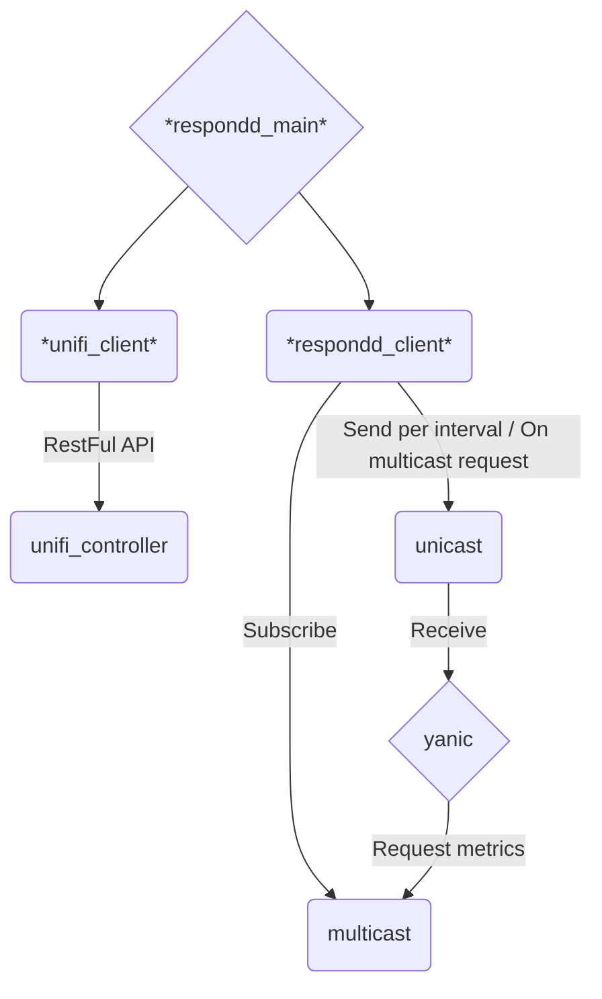

# unifi_respondd

This queries the API of a UniFi controller to get the current status of the Accesspoints and sends the information via the respondd protocol. Thus it can be picked up by `yanic` and other respondd queriers.

## Overview



## Config File:
```yaml
controller_url: unifi.lan
controller_port: 8443
username: ubnt
password: ubnt
ssid_regex: .*freifunk.*
offloader_mac:
    SiteName: 00:00:00:00:00:00
    SiteName2: 00:00:00:00:00:00
nodelist: https://MAPURL/data/meshviewer.json
version: v5
ssl_verify: True
multicast_enabled: false
multicast_address: ff05::2:1001
multicast_port: 1001
unicast_address: fe80::68ff:94ff:fe00:1504
unicast_port: 10001
interface: eth0
verbose: true
logging_config:
    formatters:
      standard:
        format: '%(asctime)s,%(msecs)d %(levelname)-8s [%(filename)s:%(lineno)d] %(message)s'
    handlers:
      console:
        class: logging.StreamHandler
        formatter: standard
    root:
      handlers:
      - console
      level: DEBUG
    version: 1
fallback_domain: "unifi_respondd_fallback"  # optional
```
