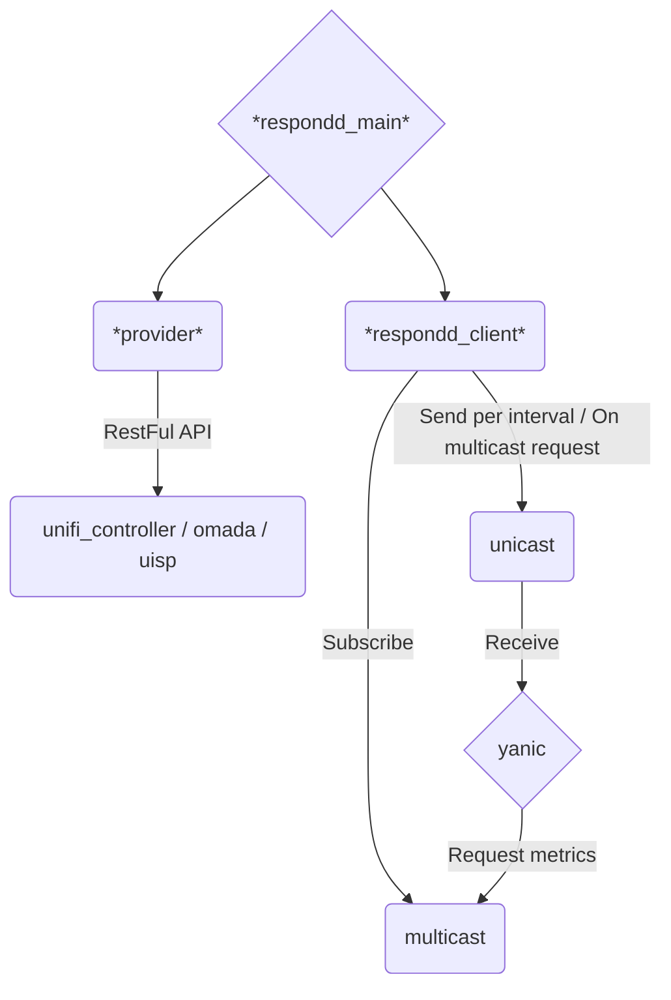

# unifi_respondd

This tool queries controller APIs (UniFi, Omada, UISP, etc.) to get the current status of Access Points and sends the information via the respondd protocol. Thus it can be picked up by `yanic` and other respondd queriers.

## Overview



## Multi-Provider Support

The tool now supports multiple controller providers in a single configuration. You can connect to multiple UniFi controllers, Omada controllers, or UISP systems simultaneously.

### Multi-Provider Config File (New Format):
```yaml
providers:
  # UniFi Controller 1
  - type: unifi
    config:
      controller_url: unifi1.lan
      controller_port: 8443
      username: ubnt
      password: ubnt
      ssid_regex: .*freifunk.*
      offloader_mac:
        SiteName: 00:00:00:00:00:00
      nodelist: https://MAPURL/data/meshviewer.json
      version: v5
      ssl_verify: True
      fallback_domain: "unifi_provider1"
  
  # UniFi Controller 2
  - type: unifi
    config:
      controller_url: unifi2.lan
      controller_port: 8443
      username: admin
      password: admin123
      ssid_regex: .*freifunk.*
      offloader_mac:
        SiteA: 11:11:11:11:11:11
      nodelist: https://MAPURL/data/meshviewer.json
      version: v5
      ssl_verify: True
      fallback_domain: "unifi_provider2"
  
  # Future: TP-Link Omada support
  # - type: omada
  #   config:
  #     controller_url: omada.lan
  #     ...
  
  # Future: Ubiquiti UISP support  
  # - type: uisp
  #   config:
  #     controller_url: uisp.lan
  #     ...

# Respondd settings
multicast_enabled: false
multicast_address: ff05::2:1001
multicast_port: 1001
unicast_address: fe80::68ff:94ff:fe00:1504
unicast_port: 10001
interface: eth0
verbose: true
logging_config:
    formatters:
      standard:
        format: '%(asctime)s,%(msecs)d %(levelname)-8s [%(filename)s:%(lineno)d] %(message)s'
    handlers:
      console:
        class: logging.StreamHandler
        formatter: standard
    root:
      handlers:
      - console
      level: DEBUG
    version: 1
```

See `unifi_respondd.multi-provider.yaml.example` for a complete example.

### Legacy Config File (Single UniFi Controller):
The legacy single-controller format is still supported for backward compatibility:

```yaml
controller_url: unifi.lan
controller_port: 8443
username: ubnt
password: ubnt
ssid_regex: .*freifunk.*
offloader_mac:
    SiteName: 00:00:00:00:00:00
    SiteName2: 00:00:00:00:00:00
nodelist: https://MAPURL/data/meshviewer.json
version: v5
ssl_verify: True
multicast_enabled: false
multicast_address: ff05::2:1001
multicast_port: 1001
unicast_address: fe80::68ff:94ff:fe00:1504
unicast_port: 10001
interface: eth0
verbose: true
logging_config:
    formatters:
      standard:
        format: '%(asctime)s,%(msecs)d %(levelname)-8s [%(filename)s:%(lineno)d] %(message)s'
    handlers:
      console:
        class: logging.StreamHandler
        formatter: standard
    root:
      handlers:
      - console
      level: DEBUG
    version: 1
fallback_domain: "unifi_respondd_fallback"  # optional
```

## Linking an Offloader to an Unifi Site by MAC Address

To link an offloader to your site in unifi_respondd, specify the MAC address of the offloader in your YAML configuration file. This enables unifi_respondd to identify the offloader device and mark it correctly on the map.

### Steps

1. Open your unifi_respondd YAML configuration file (e.g., `unifi_respondd.yaml`).
2. Add or find the section for offloader settings. (Sectionname `offloader_mac`)
3. Insert the MAC address of your offloader device like this:
   ```yaml
	offloader_mac:
	    SiteName: 00:00:00:00:00:00
   ```
4. Save the YAML file.
5. Restart the unifi_respondd service to apply the changes.


## Setting Location for UniFi Devices

To set the GPS location of each UniFi Access Point (AP):

1. Open the UniFi Controller web interface.
2. Go to the **Devices** section.
3. Select the Access Point you want to configure.
4. Click on **Settings** for that AP.
5. Under **SNMP**, enter the GPS coordinates as latitude and longitude separated by a comma in the **Location** field, e.g., `48.1351, 11.5820`.
6. Save your changes.

This sets the location for the AP, helping with accurate device placement on Freifunk maps.


## Setting Contact Information for UniFi Devices

To set contact information for each UniFi Access Point (AP):

1. Open the UniFi Controller web interface.
2. Go to the **Devices** section.
3. Select the Access Point you want to configure.
4. Click on **Settings** for that AP.
5. Under **SNMP**, enter contact details (email, phone, etc.) in the **Contact** field.
6. Save your changes.

This free-text field helps identify device ownership or provides general contact info which is shown on the Freifunk maps.


