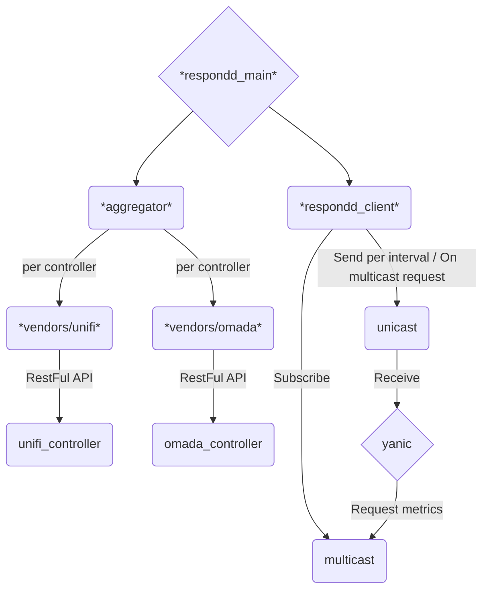

# unifi_respondd

This queries the APIs of one or more UniFi and/or Omada controllers to get the current status of the Accesspoints and sends the information via the respondd protocol. Thus it can be picked up by `yanic` and other respondd queriers.

## Overview


```mermaid
graph TD;
	A{"*respondd_main*"} -->| | B("*aggregator*")
    A -->| | C("*respondd_client*")
	B -->|"per controller"| D("*vendors/unifi*")
	B -->|"per controller"| E("*vendors/omada*")
	D -->|"RestFul API"| F("unifi_controller")
	E -->|"RestFul API"| G("omada_controller")
    C -->|"Subscribe"| H("multicast")
    C -->|"Send per interval / On multicast request"| I("unicast")
    J{"yanic"} -->|"Request metrics"| H
    I -->|"Receive"| J
```

### Supported controller types

| `type` | Controller       | Client module                       |
| ------ | ---------------- | ------------------------------------ |
| `unifi`  | Ubiquiti UniFi  | `unifi_respondd/vendors/unifi.py`   |
| `omada`  | TP-Link Omada  | `unifi_respondd/vendors/omada.py`   |

A single `unifi_respondd.yaml` can list any number of controllers, of any mix of these types, under a top-level `controllers:` key (see below) -- they're all queried each cycle and merged into one combined respondd output. Adding support for a new vendor is a small, self-contained change: a new module implementing `get_accesspoints(controller_cfg, ffnodes, fallback_domain)` plus one line in the registry at `unifi_respondd/vendors/__init__.py`.

## Config File:

### Legacy / single-controller format (still fully supported)

Any existing config in this shape keeps working unmodified -- it's implicitly treated as a single UniFi controller.

```yaml
controller_url: unifi.lan
controller_port: 8443
username: ubnt
password: ubnt
ssid_regex: .*freifunk.*
offloader_mac:
    SiteName: 00:00:00:00:00:00
    SiteName2: 00:00:00:00:00:00
nodelist: https://MAPURL/data/meshviewer.json
version: v5
ssl_verify: True
multicast_enabled: false
multicast_address: ff05::2:1001
multicast_port: 1001
unicast_address: fe80::68ff:94ff:fe00:1504
unicast_port: 10001
interface: eth0
verbose: true
logging_config:
    formatters:
      standard:
        format: '%(asctime)s,%(msecs)d %(levelname)-8s [%(filename)s:%(lineno)d] %(message)s'
    handlers:
      console:
        class: logging.StreamHandler
        formatter: standard
    root:
      handlers:
      - console
      level: DEBUG
    version: 1
fallback_domain: "unifi_respondd_fallback"  # optional
```

### Multi-controller format

Mix any number of controllers of any supported type. The `controllers:` entries hold per-controller connection details; everything else (`nodelist`, `fallback_domain`, multicast/unicast settings, `interface`, `verbose`) is shared/global across all of them -- one respondd process, one UDP socket, one scrape of `nodelist` per cycle.

```yaml
controllers:
  - type: unifi
    name: unifi-site-a
    controller_url: unifi-a.lan
    controller_port: 8443
    username: ubnt
    password: ubnt
    ssid_regex: .*freifunk.*
    offloader_mac:
      SiteNameA: 00:00:00:00:00:00
    version: v5
    ssl_verify: true

  - type: omada
    name: omada-site-c
    controller_url: https://omada.lan:8043   # port must be embedded here; controller_port is ignored for omada
    username: omada
    password: omada
    ssid_regex: .*freifunk.*
    offloader_mac:
      SiteNameC: 22:22:22:22:22:22
    ssl_verify: true

nodelist: https://MAPURL/data/meshviewer.json
fallback_domain: "unifi_respondd_fallback"  # optional
multicast_enabled: false
multicast_address: ff05::2:1001
multicast_port: 1001
unicast_address: fe80::68ff:94ff:fe00:1504
unicast_port: 10001
interface: eth0
verbose: true
```

See `unifi_respondd.yaml.example` for a full worked example including `logging_config` and a second UniFi controller.

## Linking an Offloader to an Unifi Site by MAC Address

To link an offloader to your site in unifi_respondd, specify the MAC address of the offloader in your YAML configuration file. This enables unifi_respondd to identify the offloader device and mark it correctly on the map.

### Steps

1. Open your unifi_respondd YAML configuration file (e.g., `unifi_respondd.yaml`).
2. Add or find the section for offloader settings. (Sectionname `offloader_mac`)
3. Insert the MAC address of your offloader device like this:
   ```yaml
	offloader_mac:
	    SiteName: 00:00:00:00:00:00
   ```
4. Save the YAML file.
5. Restart the unifi_respondd service to apply the changes.


## Setting Location for UniFi Devices

To set the GPS location of each UniFi Access Point (AP):

1. Open the UniFi Controller web interface.
2. Go to the **Devices** section.
3. Select the Access Point you want to configure.
4. Click on **Settings** for that AP.
5. Under **SNMP**, enter the GPS coordinates as latitude and longitude separated by a comma in the **Location** field, e.g., `48.1351, 11.5820`.
6. Save your changes.

This sets the location for the AP, helping with accurate device placement on Freifunk maps.


## Setting Contact Information for UniFi Devices

To set contact information for each UniFi Access Point (AP):

1. Open the UniFi Controller web interface.
2. Go to the **Devices** section.
3. Select the Access Point you want to configure.
4. Click on **Settings** for that AP.
5. Under **SNMP**, enter contact details (email, phone, etc.) in the **Contact** field.
6. Save your changes.

This free-text field helps identify device ownership or provides general contact info which is shown on the Freifunk maps.

## Setting Location for Omada Devices

To set the GPS location of each Omada Access Point (AP):

1. Open the Omada Controller web interface.
2. Go to the **Devices** section.
3. Select the Access Point you want to configure.
4. Click on **Config** for that AP.
5. Under **Services**, enter the GPS coordinates as latitude and longitude separated by a comma in the **Location** field under **SNMP**, e.g., `48.1351, 11.5820`.
6. Save your changes.
7. Restart the unifi_respondd service to apply the changes.

This sets the location for the AP, helping with accurate device placement on Freifunk maps.

## Setting Contact Information for Omada Devices

To set contact information for each Omada Access Point (AP):

1. Open the Omada Controller web interface.
2. Go to the **Devices** section.
3. Select the Access Point you want to configure.
4. Click on **Config** for that AP.
5. Under **Services**, enter contact details (email, phone, etc.) in the **Contact** field under **SNMP**.
6. Save your changes.
7. Restart the unifi_respondd service to apply the changes.

This free-text field helps identify device ownership or provides general contact info which is shown on the Freifunk maps.

## Acknowledgments / Third-party code

The Omada controller client (`unifi_respondd/vendors/omada_api/`) vendors the MIT-licensed Omada REST API wrapper originally written by Gregory Haberek (Copyright (c) 2021), kept byte-for-byte identical to upstream. See `unifi_respondd/vendors/omada_api/LICENSE` for the full license text.


