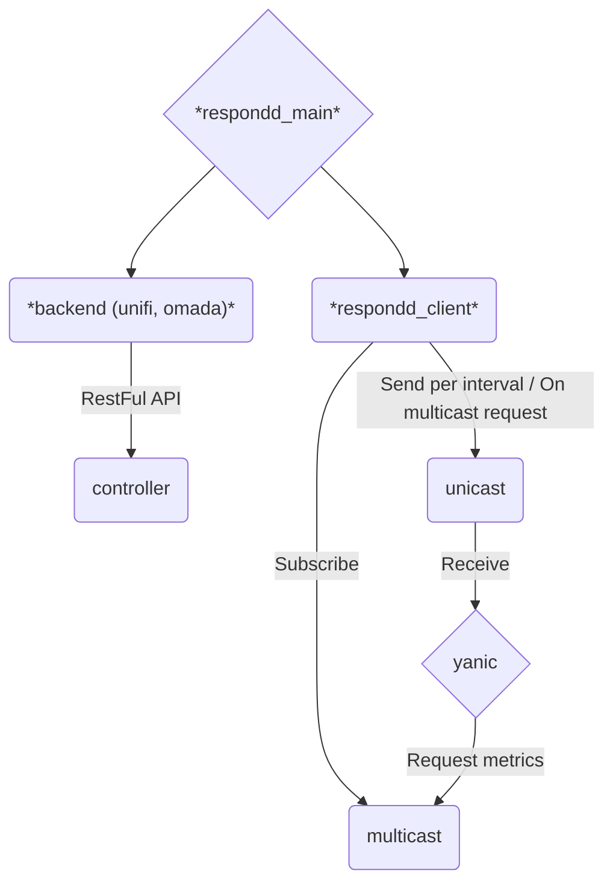

# unified_respondd

This queries the API of a WiFi controller to get the current status of the Accesspoints and sends the information via the respondd protocol. Thus it can be picked up by `yanic` and other respondd queriers.

Supported controllers (backends):

| Backend | Controller |
|---------|------------|
| `unifi` | UniFi Network controller |
| `omada` | TP-Link Omada controller |

## Installation

Install the package together with the dependencies of your backend:

```sh
pip install 'unified_respondd[unifi]'   # or [omada]
UNIFIED_RESPONDD_CONFIG_FILE=/etc/unified_respondd.yaml unified-respondd
```

Running `./respondd.py` from a checkout (after `pip install -r requirements.txt`) keeps working for existing deployments.

## Choosing the backend

Set `backend` in the config file. It defaults to `unifi`, so existing `unifi_respondd` configs work unchanged.

The config file is looked up in this order:

1. `UNIFIED_RESPONDD_CONFIG_FILE`, then the legacy `UNIFI_RESPONDD_CONFIG_FILE`
2. `./unified_respondd.yaml`, then the legacy `./unifi_respondd.yaml`

## Testing against a controller

`--dry-run` queries the controller once, prints the respondd data per node as JSON and exits without sending anything:

```sh
UNIFIED_RESPONDD_CONFIG_FILE=/etc/unified_respondd.yaml unified-respondd --dry-run
```

## Migrating from omada_respondd

1. Install `unified_respondd[omada]` (or `pip install -r requirements.txt` in a checkout).
2. Add `backend: omada` to the config. `controller_port` is no longer needed, the port is part of `controller_url`.
3. Rename `OMADA_respondd.yaml` to `unified_respondd.yaml` or point `UNIFIED_RESPONDD_CONFIG_FILE` to it. `OMADA_RESPONDD_CONFIG_FILE` is not read anymore.
4. Check the output with `--dry-run`, then restart the service.

Behaviour changes compared to omada_respondd:

- APs whose Freifunk SSID is disabled are no longer reported.
- APs without an SNMP location are reported (with the location from the controller, or 0/0).
- The uplink neighbour MAC is lowercase, so it matches the node MAC.
- One login per query for all sites, followed by a logout.
- A failing site or AP is skipped and logged instead of aborting the whole query.

## Overview


```mermaid
graph TD;
	A{"*respondd_main*"} -->| | B("*backend (unifi, omada)*")
    A -->| | C("*respondd_client*")
	B -->|"RestFul API"| D("controller")
    C -->|"Subscribe"| E("multicast")
    C -->|"Send per interval / On multicast request"| F("unicast")
    G{"yanic"} -->|"Request metrics"| E
    F -->|"Receive"| G
```

## Config File

See [`unifi_respondd.yaml.example`](unifi_respondd.yaml.example) and [`unified_respondd.omada.yaml.example`](unified_respondd.omada.yaml.example). The unifi config:

```yaml
backend: unifi
controller_url: unifi.lan
controller_port: 8443
username: ubnt
password: ubnt
ssid_regex: .*freifunk.*
offloader_mac:
    SiteName: 00:00:00:00:00:00
    SiteName2: 00:00:00:00:00:00
nodelist: https://MAPURL/data/meshviewer.json
version: v5
ssl_verify: True
multicast_enabled: false
multicast_address: ff05::2:1001
multicast_port: 1001
unicast_address: fe80::68ff:94ff:fe00:1504
unicast_port: 10001
interface: eth0
verbose: true
logging_config:
    formatters:
      standard:
        format: '%(asctime)s,%(msecs)d %(levelname)-8s [%(filename)s:%(lineno)d] %(message)s'
    handlers:
      console:
        class: logging.StreamHandler
        formatter: standard
    root:
      handlers:
      - console
      level: DEBUG
    version: 1
fallback_domain: "unifi_respondd_fallback"  # optional
```

The omada backend uses the same keys, except `version` and `controller_port`. `controller_url` includes the port, e.g. `https://omada.lan:8043`.

## Development

```sh
pip install -r requirements-dev.txt -e '.[unifi,omada]'
pytest
ruff check . && ruff format --check .
```

## Linking an Offloader to a Site by MAC Address

To link an offloader to your site, specify the MAC address of the offloader in your YAML configuration file. This enables unified_respondd to identify the offloader device and mark it correctly on the map. The key is the name of the site in the controller.

### Steps

1. Open your YAML configuration file (e.g., `unified_respondd.yaml`).
2. Add or find the section for offloader settings. (Sectionname `offloader_mac`)
3. Insert the MAC address of your offloader device like this:
   ```yaml
	offloader_mac:
	    SiteName: 00:00:00:00:00:00
   ```
4. Save the YAML file.
5. Restart the service to apply the changes.


## Setting Location for UniFi Devices

To set the GPS location of each UniFi Access Point (AP):

1. Open the UniFi Controller web interface.
2. Go to the **Devices** section.
3. Select the Access Point you want to configure.
4. Click on **Settings** for that AP.
5. Under **SNMP**, enter the GPS coordinates as latitude and longitude separated by a comma in the **Location** field, e.g., `48.1351, 11.5820`.
6. Save your changes.

This sets the location for the AP, helping with accurate device placement on Freifunk maps.


## Setting Contact Information for UniFi Devices

To set contact information for each UniFi Access Point (AP):

1. Open the UniFi Controller web interface.
2. Go to the **Devices** section.
3. Select the Access Point you want to configure.
4. Click on **Settings** for that AP.
5. Under **SNMP**, enter contact details (email, phone, etc.) in the **Contact** field.
6. Save your changes.

This free-text field helps identify device ownership or provides general contact info which is shown on the Freifunk maps.

## Setting Location for Omada Devices

To set the GPS location of each Omada Access Point (AP):

1. Open the Omada Controller web interface.
2. Go to the **Devices** section.
3. Select the Access Point you want to configure.
4. Click on **Config** for that AP.
5. Under **Services**, enter the GPS coordinates as latitude and longitude separated by a comma in the **Location** field under **SNMP**, e.g., `48.1351, 11.5820`.
6. Save your changes.

If the SNMP location is empty, the location configured for the AP in the controller is used.

## Setting Contact Information for Omada Devices

To set contact information for each Omada Access Point (AP):

1. Open the Omada Controller web interface.
2. Go to the **Devices** section.
3. Select the Access Point you want to configure.
4. Click on **Config** for that AP.
5. Under **Services**, enter contact details (email, phone, etc.) in the **Contact** field under **SNMP**.
6. Save your changes.
