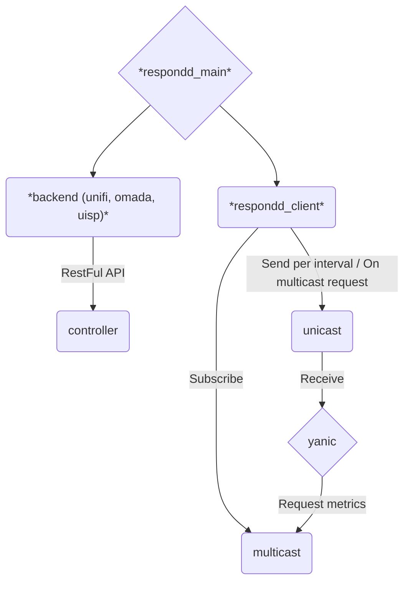

# unified_respondd

This queries the API of a WiFi controller to get the current status of the Accesspoints and sends the information via the respondd protocol. Thus it can be picked up by `yanic` and other respondd queriers and shown on Freifunk maps.

It replaces the former `unifi_respondd`, `omada_respondd` and `uisp_respondd`. Supported controllers (backends):

| Backend | Controller |
|---------|------------|
| `unifi` | UniFi Network controller |
| `omada` | TP-Link Omada controller |
| `uisp` | UISP (airFiber, airMAX, … links) |


```mermaid
graph TD;
	A{"*respondd_main*"} -->| | B("*backend (unifi, omada, uisp)*")
    A -->| | C("*respondd_client*")
	B -->|"RestFul API"| D("controller")
    C -->|"Subscribe"| E("multicast")
    C -->|"Send per interval / On multicast request"| F("unicast")
    G{"yanic"} -->|"Request metrics"| E
    F -->|"Receive"| G
```

## Installation

Install the package together with the dependencies of your backend, e.g. into `/opt/unified-respondd`:

```sh
python3 -m venv /opt/unified-respondd
/opt/unified-respondd/bin/pip install 'unified_respondd[unifi] @ git+https://github.com/freifunkMUC/unified_respondd'
```

Use `[omada]` or `[uisp]` for the other backends, or once a release is on PyPI simply `pip install 'unified_respondd[unifi]'`.

Running `./respondd.py` from a checkout (after `pip install -r requirements.txt`) keeps working for existing deployments.

### Dependencies

- Python 3.10 or newer, `pyyaml` and `dataclasses-json`
- `unifi`: `pyunifi`, `geopy`, `requests`
- `omada`: `geopy`, `requests` (the Omada API client is vendored)
- `uisp`: `requests`
- The controller API and, for `unifi` and `omada`, the meshviewer `nodelist` to look up the offloaders
- For `unifi` and `omada`: SNMP locations that aren't coordinates are geocoded via Nominatim (OpenStreetMap)

## Configuration

Set `backend` in the config file. It defaults to `unifi`, so existing `unifi_respondd` configs work unchanged. See [`examples/`](examples) for a config per backend.

The config file is looked up in this order:

1. `UNIFIED_RESPONDD_CONFIG_FILE`, then the legacy `UNIFI_RESPONDD_CONFIG_FILE`
2. `./unified_respondd.yaml`, then the legacy `./unifi_respondd.yaml`

Keys of all backends:

| Key | Description |
|-----|-------------|
| `backend` | `unifi` (default), `omada` or `uisp` |
| `multicast_enabled` | Answer multicast requests (`true`) or send per interval via unicast (`false`) |
| `multicast_address`, `multicast_port` | Multicast group to join, e.g. `ff05::2:1001` and `1001` |
| `unicast_address`, `unicast_port` | Where to send the data in unicast mode |
| `interface` | Interface to bind to |
| `verbose` | Log more details |
| `logging_config` | Optional [logging dictConfig](https://docs.python.org/3/library/logging.config.html#logging-config-dictschema) |
| `fallback_domain` | Optional domain if no offloader is found (default `<backend>_respondd_fallback`) |
| `unknown_location` | APs without a location (0/0): `report` them at 0/0 (default), `omit` the location so they are listed but not shown on the map, or `skip` them |

Keys of the backends:

| Key | `unifi` | `omada` | `uisp` |
|-----|:-------:|:-------:|:------:|
| `controller_url` | host, e.g. `unifi.lan` | URL with port, e.g. `https://omada.lan:8043` | API base URL, e.g. `https://uisp.lan/nms/api/v2.1` |
| `controller_port` | ✓ | – | – |
| `username`, `password` | ✓ | ✓ | – |
| `token` | – | – | ✓ |
| `version` | ✓ (e.g. `v5`, `UDMP-unifiOS`) | – | – |
| `ssl_verify` | ✓ | ✓ | – |
| `ssid_regex` | ✓ | ✓ | – |
| `offloader_mac`, `nodelist` | ✓ | ✓ | – |

With `skip`, links of other nodes to a skipped AP still show up in their neighbours.

`unifi` and `omada` only report APs broadcasting an SSID that matches `ssid_regex`. `uisp` reports all connected devices except those with `Router` in their name, the neighbours come from the UISP data links.

## Running

### systemd

[`examples/unified-respondd@.service`](examples/unified-respondd@.service) is a template unit, one instance per controller:

```sh
install -m 0600 unifi.yaml /etc/unified-respondd/unifi.yaml
systemctl enable --now unified-respondd@unifi
```

The unit runs as an unprivileged `DynamicUser` and gets the config via `LoadCredential`, which needs systemd 247 or newer. The unit file explains the alternative for older systemd.

Several instances can run on one host in unicast mode. In multicast mode only one instance can bind the multicast port.

For OpenWrt there is a procd script in [`examples/unified-respondd.init.d`](examples/unified-respondd.init.d).

### Testing against a controller

`--dry-run` queries the controller once, prints the respondd data per node as JSON and exits without sending anything:

```sh
UNIFIED_RESPONDD_CONFIG_FILE=/etc/unified-respondd/unifi.yaml unified-respondd --dry-run
```

It exits with 1 if the controller couldn't be queried.

## Operations

- **Logging:** Everything is logged to stderr, with systemd to the journal: `journalctl -u unified-respondd@unifi`. Failed controller or nodelist requests are logged as `ERROR`, the query is retried in the next interval. The format and level can be changed with `logging_config`.
- **Monitoring:** systemd restarts the service if it exits (`Restart=always`). HTTP requests time out after 30 seconds, so a hanging controller doesn't block the service. `unified-respondd --dry-run` can be used as a check, it fails if the controller is unreachable. Whether the nodes are current can be seen on the map or in yanic.
- **Rollback:** Install the previous version (`pip install 'unified_respondd[…] @ git+https://github.com/freifunkMUC/unified_respondd@<tag>'` or check out the previous tag) and restart the service. When migrating from `omada_respondd` or `uisp_respondd`, keep the old installation and leave `controller_port` in the config until the new service runs fine: the old versions require it and ignore the new `backend` key.

## Migrating

### From unifi_respondd

Nothing to change, the config and `respondd.py` keep working. Optionally add `backend: unifi` and rename the config to `unified_respondd.yaml`.

### From omada_respondd

1. Install `unified_respondd[omada]` (or `pip install -r requirements.txt` in a checkout).
2. Add `backend: omada` to the config. `controller_port` is no longer used, the port is part of `controller_url`.
3. Rename `OMADA_respondd.yaml` to `unified_respondd.yaml` or point `UNIFIED_RESPONDD_CONFIG_FILE` to it. `OMADA_RESPONDD_CONFIG_FILE` is not read anymore.
4. Check the output with `--dry-run`, then restart the service.

Behaviour changes compared to omada_respondd:

- APs whose Freifunk SSID is disabled (`ssidEnabled: false`) are no longer reported.
- APs without an SNMP location are reported (with the location from the controller, or 0/0).
- The uplink neighbour MAC is lowercase, so it matches the node MAC.
- One login per query for all sites, followed by a logout.
- A failing site or AP is skipped and logged instead of aborting the whole query.

### From uisp_respondd

1. Install `unified_respondd[uisp]` (or `pip install -r requirements.txt` in a checkout).
2. Add `backend: uisp` to the config. `controller_port` is no longer used. `controller_url` is the API base URL without `/devices`, e.g. `https://uisp.example.org/nms/api/v2.1`.
3. Rename `uisp_respondd.yaml` to `unified_respondd.yaml` or point `UNIFIED_RESPONDD_CONFIG_FILE` to it. `UISP_RESPONDD_CONFIG_FILE` is not read anymore.
4. Check the output with `--dry-run`, then restart the service.

Behaviour changes compared to uisp_respondd:

- The firmware base is `UISP` instead of `UniFi`.
- `fallback_domain` sets the domain of the devices (default `uisp_respondd_fallback`).
- The data links are fetched once per query instead of once per device.
- Requests time out after 30 seconds, failed requests are logged.
- The statistics contain `gateway*: null` and `wireless: []`, the nodeinfo `owner.contact: null` and devices without a link an empty neighbour list, like the other backends.

## Controller setup

### Linking an Offloader to a Site by MAC Address

To link an offloader to your site (`unifi` and `omada`), specify the MAC address of the offloader in your YAML configuration file. This enables unified_respondd to identify the offloader device and mark it correctly on the map. The key is the name of the site in the controller.

1. Open your YAML configuration file (e.g., `unified_respondd.yaml`).
2. Add or find the section for offloader settings. (Sectionname `offloader_mac`)
3. Insert the MAC address of your offloader device like this:
   ```yaml
   offloader_mac:
       SiteName: 00:00:00:00:00:00
   ```
4. Save the YAML file.
5. Restart the service to apply the changes.


### Setting Location for UniFi Devices

To set the GPS location of each UniFi Access Point (AP):

1. Open the UniFi Controller web interface.
2. Go to the **Devices** section.
3. Select the Access Point you want to configure.
4. Click on **Settings** for that AP.
5. Under **SNMP**, enter the GPS coordinates as latitude and longitude separated by a comma in the **Location** field, e.g., `48.1351, 11.5820`.
6. Save your changes.

This sets the location for the AP, helping with accurate device placement on Freifunk maps.


### Setting Contact Information for UniFi Devices

To set contact information for each UniFi Access Point (AP):

1. Open the UniFi Controller web interface.
2. Go to the **Devices** section.
3. Select the Access Point you want to configure.
4. Click on **Settings** for that AP.
5. Under **SNMP**, enter contact details (email, phone, etc.) in the **Contact** field.
6. Save your changes.

This free-text field helps identify device ownership or provides general contact info which is shown on the Freifunk maps.

### Setting Location for Omada Devices

To set the GPS location of each Omada Access Point (AP):

1. Open the Omada Controller web interface.
2. Go to the **Devices** section.
3. Select the Access Point you want to configure.
4. Click on **Config** for that AP.
5. Under **Services**, enter the GPS coordinates as latitude and longitude separated by a comma in the **Location** field under **SNMP**, e.g., `48.1351, 11.5820`.
6. Save your changes.

If the SNMP location is empty, the location configured for the AP in the controller is used.

### Setting Contact Information for Omada Devices

To set contact information for each Omada Access Point (AP):

1. Open the Omada Controller web interface.
2. Go to the **Devices** section.
3. Select the Access Point you want to configure.
4. Click on **Config** for that AP.
5. Under **Services**, enter contact details (email, phone, etc.) in the **Contact** field under **SNMP**.
6. Save your changes.

### UISP

The location of a device is taken from UISP. The neighbours are the links configured in UISP.

## Development

```sh
pip install -r requirements-dev.txt -e '.[unifi,omada,uisp]'
pytest
ruff check . && ruff format --check .
```

A new backend is a module in `src/unified_respondd/backends/` with a `ControllerConfig` and a `get_infos(cfg)` returning `model.Accesspoints`, registered in `backends/__init__.py`.

## Ownership

Maintained by [@freifunkMUC/firmware](https://github.com/orgs/freifunkMUC/teams/firmware). Please report issues and send pull requests on GitHub.
